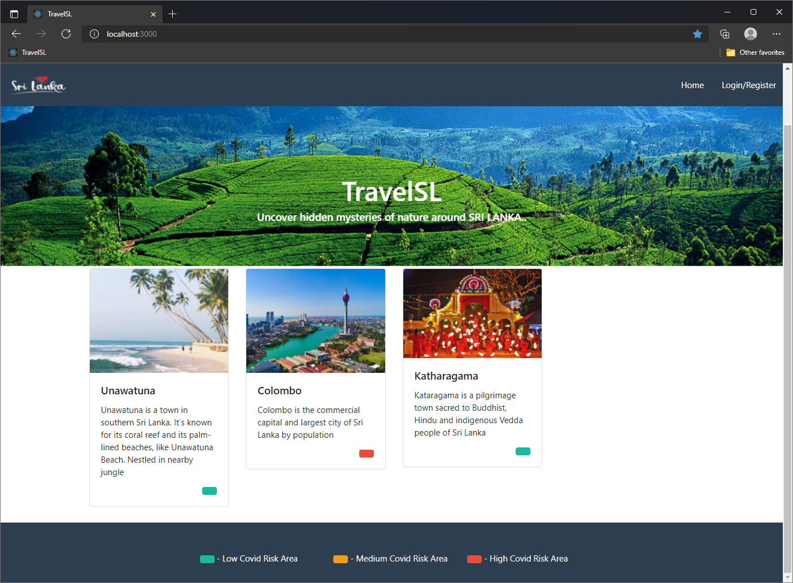

## TravelSl - Basic event management system with insert and delete of events. React, ExpressJS, MongoDB, JWT-Login, Containerized using Docker
\
&nbsp;
### Useful Commands
* ` npm install` -> go inside api folder and run this command to install node modules
* ` npm install` -> go inside client folder and run this command to install node modules
* ` docker-compose up --buld ` -> trun this in root directory to build and start containers
* ` docker-compose up -d ` -> to run all container
* ` docker-compose down ` -> to stop all container
* ` docker-compose build ` -> to build all container

